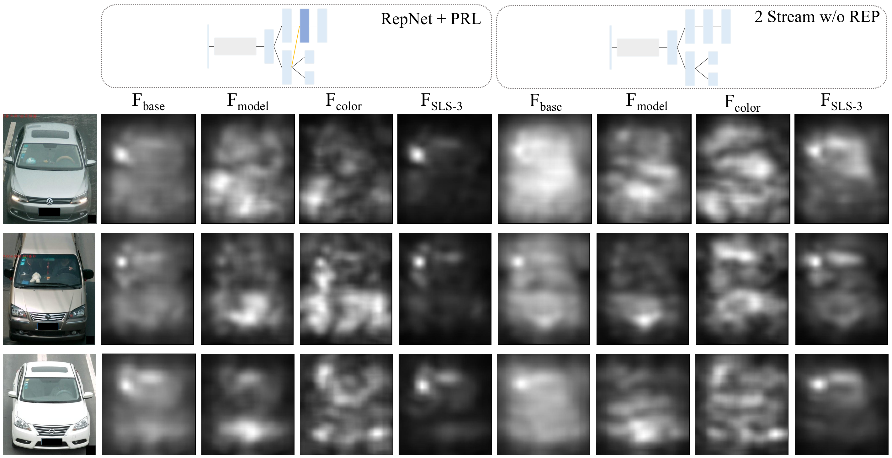

# Repression Network

Repression Network is a multi-task learning framework designed for precise image retrieval tasks. More details, please refer to [our paper](https://arxiv.org/abs/1708.02386).


## Datasets
The vehicle dataset we used in this work is the [PKU VehicleID](http://pkuml.org/resources/pku-vehicleid.html). Please contact them for the whole dataset.

#### Label Files
- `Training_data_labels.txt`: The list of training data with each column representing filename, vehicle ID, model type, vehicle color and indicator of the view (face/back). 
- `siyang_label.txt`: The data we used for retrieval experiments. The labels are in format 'vehicleID_view'.

#### List Files
- `list.txt`: List of all the training data.
- Query Lists: 
  - `query_list_all.txt`
  - `query_list_hard.txt`
  - `query_list_random.txt`
- We split the training data into training set `train_list.txt` and validation set `test_list.txt`.

#### Helper Scripts
- `triplet_generator.py`: used to generate training triplets.
- `data_list_generator.py`
- `query_generator.py` 


## Models
[Caffe](http://caffe.berkeleyvision.org) is used in this project. You can refer to [my caffe repo](https://github.com/xuqiantong/MyCaffe) which supports triplet loss. We provide prototxt files which describes model structure and training schemes. One may visulize the model architecture using [Netscope](http://ethereon.github.io/netscope/quickstart.html).

#### Models:
`train_*.prototxt` describes the complete model architecture which we used for training. `deploy_*.prototxt` are the ones we use to generate features with a trained model. 

- Base Models: Designed only for attributes classification. 
  - `v0_1` uses seperate branch/feature for each attribute while 
  - `v0_2` has one feature for all attributes
- RepNets: 
	- `v2` with CRL
	- `v5` with SRL
	- `v6` with PRL
- Comparisons: Use the same convolutional groups as RepNet
  - `v2_cmp` is a similar two stream model as RepNet, but without repression layer in between.
  - `v7` is a simple one stream model, in which all the loss functions are connected to the final FC layer.
  - `v1` is also a onw stream model, but have several previous fully connected (FC) layers concatenated before the embedding being fed into the final triplet loss.

## Retrieval Experiments
After the model is trained to convergence, we will use the deployed models to generate features for each image in the retrieval dataset and the features are used to represent the similarity between images. 
You can actually generate every kind of feature you want including real features, softmax features and predict lables. Please refer to `gen_*_feature.py`. 

With the features generated, we use $L2$ distance during the search phase. Of course, we support bucket search. You can set the number of neighbor buckets in `search_v3.py`.


## New Attribute for PKU VehicleID
We create a new attribute *view*, to descibe the whether the image is the face or back of a vehicle, for the VehicleID dataset by building a face/back classifier. The label and model training prototxt files are in the corresponding folder. Our work focus mainly on the face images.

## License and Citation
Please cite our paper in your publications if it helps your research:
```
@article{xu2017learning,
  title={Learning a Repression Network for Precise Vehicle Search},
  author={Xu, Qiantong and Yan, Ke and Tian, Yonghong},
  journal={arXiv preprint arXiv:1708.02386},
  year={2017}
}
```
